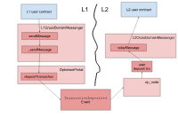
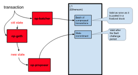
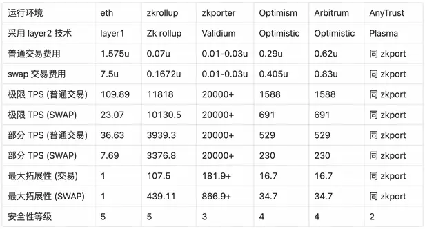
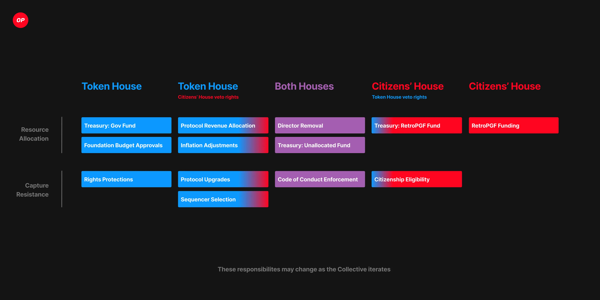

# Bruce Xu

## 自我介绍

大家好，我是 Bruce，对 OP 非常感兴趣，然后希望可以通过这次共学，系统性的理解和认识一下 Optimism 的生态和相关信息知识等。

我的推特 <https://x.com/brucexu_eth> 欢迎关注。

## 你认为你会完成本次残酷学习吗？

那必须的

## Notes

<!-- Content_START -->

### 2025.01.06

#### Layer2 扩容方案: https://docs.optimism.io/stack/rollup/overview

TODO OP Stack Specification https://specs.optimism.io/

AI：OP Stack 是一个模块化的区块链开发框架，它允许任何人部署与 Optimism 兼容的 L2 网络。它的规范文档详细说明了如何实现一个完整的 OP Chain，包括：

1. 共识机制：采用单一 sequencer 模式
2. 执行层：与以太坊 EVM 完全兼容
3. 数据可用性：数据存储在以太坊 L1 上
4. 验证系统：通过 fault proof 确保安全性
5. 跨链桥接：标准化的消息传递系统

目前 OP 的 L2 Blocks 存放在 https://etherscan.io/address/0xff00000000000000000000000000000000000010 这个地址的 blob 上面。提交之后，就无法被改变或者审查，这就是 L2 继承以太坊可用性和完整性的方式。

保存数据的时候，保存的是压缩过的数据，所以可以节约 gas，现在保存到 blob 上面，gas 更低了。

DONE Bedrock 是什么？

AI：Bedrock 是 OP Stack 的一次重大升级，于 2023 年 6 月推出。主要改进包括：

1. 重写了节点软件，提高了性能和可靠性
2. 降低了交易费用，通过优化数据压缩和批处理
3. 改进了与以太坊的兼容性，支持更多 EVM 操作码
4. 简化了系统架构，使得维护和升级更容易
5. 增强了模块化设计，便于其他项目复用代码

TODO 看一下数据压缩规则以及原始数据 https://specs.optimism.io/protocol/derivation.html#batch-submission-wire-format

AI：OP 的数据压缩主要通过以下方式实现：

1. Channel 格式：将多个交易打包成 channel
2. 压缩算法：使用 zlib 进行数据压缩
3. 批处理提交：多个 channel 组合成 batch，再提交到 L1
4. 数据编码：使用高效的二进制格式，减少存储空间
5. 去重优化：相似交易数据会被优化存储

---

OP Gas fee 的运转流程 https://docs.optimism.io/stack/transactions/fees：

- EVM 等效，类似以太坊的运行方式，但是有一些不同
- 实际 gas = L2 执行 gas + L1 数据保存费用
- L2 执行 gas 的计算规则以太坊一样，所以执行的 gas 一样，也使用 EIP-1559 设置 base fee 等。但是 gas 的价格是非常低的
- OP 进行了一些小参数调整，所以有更短的区块时间
- The eth_maxPriorityFeePerGas RPC method can be used to estimate a priority fee that will get your transaction included quickly.
- 商业模式就是赚 gas fee 的利差，自己的成本低，然后收取一定的 gas，把 L1 的 gas 成本扣掉就可以盈利了。所以交易和使用量就是最关键的指标和数据
-

L1 Data 的 gas fee 计算规则


Sequencer Fee Vault 收集和保存 OP sequencer 的 gas fee，然后用于支付 data 到 L1 的 gas fee。被 predeployed 到 0x4200000000000000000000000000000000000011 这个地址

https://optimistic.etherscan.io/address/0x4200000000000000000000000000000000000011

基本的商业模式：

- 构建一个更中心化高效的以太坊区块链，收取较低的 Gas fee，不追求去中心化的安全性
- 通过把数据定期同步保存到 L1 实现数据可用性和安全性，通过一些校验机制确保区块安全
- 实际成本在把数据同步到 L1 的 gas 消耗，所以赚取上面 gas 的利差，通过一些脚本实现自动化的数据搬运等

实现了更快更便宜的交易，同时一定程度的保证了安全性。

OP uses a simple party, sequencer to:

- Provide tx confirmation and state updates
- build L2 blocks
- submit L2 blocks to L1

In OP, generate a block every 2 seconds.

TODO OP 上面的交易通过 sequencer 来生成和决策，那么如何避免 sequencer 的作恶或者审查？下面这个叙述没看懂：Transactions submitted on L1 (called deposits) are included in the chain in the appropriate L2 block. Every L2 block is identified by the "epoch" (the L1 block to which it corresponds, which typically has happened a few minutes before the L2 block) and its serial number within that epoch. The first block of the epoch includes all the deposits that happened in the L1 block to which it corresponds. If the sequencer attempts to ignore a legitimate L1 transaction, it ends up with a state that is inconsistent with the verifiers, same as if the sequencer tried to fake the state by other means. This provides OP Mainnet with L1 Ethereum level censorship resistance. You can read more about this mechanism in the protocol specifications.

AI：OP 通过多重机制来防止 sequencer 作恶：

1. 强制包含 L1 存款交易：sequencer 必须按顺序包含所有通过 L1 提交的交易
2. 状态验证：验证者节点会验证 sequencer 提交的状态
3. Fault Proof 系统：如果 sequencer 作恶，可以通过故障证明进行惩罚
4. 去中心化计划：未来会引入去中心化 sequencer 网络
5. 社区监督：任何人都可以运行验证节点监控 sequencer 行为

~~TODO OP 目前有多少节点？~~

AI：OP 的节点网络包括：

1. 主要 Sequencer：由 OP 基金会运营的中心化节点
2. 验证节点：任何人都可以运行，目前约有数百个
3. 归档节点：存储完整历史数据的节点
4. RPC 节点：提供 API 服务的节点

TODO 具体活跃节点在哪里查看？

~~TODO OP Sequencer 在哪里运行？如果被攻击了怎么办？是一个单点风险吗？~~

AI：OP Sequencer 的运行情况：

1. 部署位置：在 AWS 云服务上运行，有多区域备份
2. 攻击应对：
   - 如果 Sequencer 被攻击，用户仍可通过 L1 提交交易
   - 基金会可以快速切换备用 Sequencer
   - 验证节点网络保证数据安全性
3. 风险缓解：
   - 正在推进 Sequencer 去中心化
   - 多重签名控制关键更新
   - 完善的灾难恢复机制

TODO OP 宣称可以 send arbitrary messages between smart contracts on L2 and L1，这样可以 transfer ETH 和 ERC20 等。跨链和 deposit 是怎么做到的？阅读 https://docs.optimism.io/builders/app-developers/bridging/standard-bridge 然后实际跨链进行分析。

TODO 包括了原生的跨链流程，还有一些 L2 的跨链服务的研究，例如 orbiter 等。L2 -> L1 的技术文档 https://specs.optimism.io/protocol/withdrawals.html

Fault proofs 故障证明（之前叫 fraud proofs 欺诈证明）

state commitments 先提交到 L1，然后等待一段时间让大家做出挑战，没有挑战就是 final，然后就可以接受 withdrawal proofs 了，进行正式的交易。

TODO 这里 PGNode or ETHPanda 可以做一个 challenger 托管一个校验节点。

It's important to note that a successful challenge does not roll back OP Mainnet itself, only the published commitments about the state of the chain. The ordering of transactions and the state of OP Mainnet is unchanged by a fault proof challenge.

AI：OP 的跨链机制包括：

1. 标准桥接：
   - L1 → L2：通过存款合约直接发送
     - TODO 怎么 mint 出来呢？
   - L2 → L1：需要等待 7 天挑战期
2. 快速桥接服务：
   - Orbiter：提供快速跨链，有一定信任假设
   - 其他第三方桥如 Hop、Across 等
     - TODO 这些桥的实现原理是什么？
3. 消息传递：
   - 支持任意消息跨链
   - 可用于复杂的跨链操作
4. 安全考虑：
   - 官方桥最安全但较慢
   - 快速桥需要权衡安全性和速度

TODO 如果不回滚 OP 的数据，那么这个 state commitment 是谁来提交的？有错误信息之后怎么处理？

AI：如果不回滚 OP 的数据，这个故障证明系统的作用是：

1. 阻止错误状态进入 L1：
   - 防止基于错误状态的提款
   - 维护资产安全性
2. 惩罚机制：
   - 可能会惩罚作恶的 Sequencer
   - 触发紧急治理机制
3. 状态同步：
   - 验证者可以重新同步到正确状态
   - 保持网络一致性
4. 用户资产安全：
   - 即使状态出错，用户资产仍然安全
   - 可以通过 L1 合约保障权益

TODO research EIP-1559

Reading

- https://docs.optimism.io/stack/transactions/deposit-flow
- https://docs.optimism.io/stack/transactions/withdrawal-flow
- https://docs.optimism.io/stack/transactions/transaction-flow
- https://docs.optimism.io/builders/chain-operators/self-hosted
- https://docs.optimism.io/builders/chain-operators/tutorials/create-l2-rollup

### 2025.01.07

## Deposit flow https://docs.optimism.io/stack/transactions/deposit-flow



这个图花的有点问题不是很容易理解，应该是 op_node 在中间，监听了 L1 的 Event 然后 relay 了这个交易到 L2。

TODO 有空系统性的研究一下跨链重新画一下吧。

L1 -> L2：

- L1 sendMessage 到合约，包括目标地址、value、data 等
- L1 合约调用 \_depositTransaction 方法，经过一些检查之后，Emit a TransactionDeposited event so that the rollup node can derive a deposit transaction for the deposit。是一个链下的行为
- L2 节点监听事件然后判断没有问题之后，relay calldata 实现 L2 上面出现资产

用 USDT 为例，大概流程就是：

1. 发送 USDT 到 L1 的 bridge 锁定合约（找了下疑似这个，不确定对不对 https://etherscan.io/address/0x99c9fc46f92e8a1c0dec1b1747d010903e884be1）
2. L1 确认无误后，触发事件
3. rollup node 拿到事件，然后检查之后，在 L2 的网络上重放 mint 出来对等的 token 到对应地址

其中系统需要保证 mint 出来的 token 是 1 比 1 对等的，如果不对，可以提交 proof 挑战，然后成功后 state 回滚，拿到奖励。

TODO L2 上面部署的对应的 token 合约是跟 L1 一样的吗？通过拿到代码或者对应的 calldata 直接部署？

TODO 分析一个实际的 native 跨链案例 https://etherscan.io/tx/0xab6ceb1c52fc7f38e034f300a00314c5203afb12275a895b219a347be74e43b5#eventlog 、 https://etherscan.io/address/0x99c9fc46f92e8a1c0dec1b1747d010903e884be1

TODO 一些视频：

- Send ERC20 between L1 and L2 | Optimism https://www.youtube.com/watch?v=yyKDin9r94g&ab_channel=SmartContractProgrammer
- Send Message from L1 to L2 | Optimism https://www.youtube.com/watch?v=SKl5pEs8reY&ab_channel=SmartContractProgrammer
- Send ETH between L1 and L2 | Optimism https://www.youtube.com/watch?v=8Rx56fj1kkM&ab_channel=SmartContractProgrammer

TODO https://ethereum.org/en/developers/tutorials/optimism-std-bridge-annotated-code/

做了一下 Replaying messages 的测试，私钥是随机生成的可以直接执行使用：

```
PRIV_KEY=d7536bb0d6a471f166056bcd400a43904b9cf9e72a676eae0eb23e5e67e797f1
export ETH_RPC_URL=https://sepolia.optimism.io
GREETER=0xEF60cF6C6D0C1c755be104843bb72CDa3D778630
cast send --private-key $PRIV_KEY $GREETER "stopChanges()"

blockHash            0x8203390c908ed52e9def882fc27b9cc94ffce38d643ffab751856b49e1e29df9
blockNumber          22205996
contractAddress
cumulativeGasUsed    712603
effectiveGasPrice    512
from                 0x6678d1F1F7429f4F344A36fbC029B9a759A59486
gasUsed              23472
logs                 []
logsBloom            0x00000000000000000000000000000000000000000000000000000000000000000000000000000000000000000000000000000000000000000000000000000000000000000000000000000000000000000000000000000000000000000000000000000000000000000000000000000000000000000000000000000000000000000000000000000000000000000000000000000000000000000000000000000000000000000000000000000000000000000000000000000000000000000000000000000000000000000000000000000000000000000000000000000000000000000000000000000000000000000000000000000000000000000000000000000000
root
status               1 (success)
transactionHash      0x94c4afbc8469d7c8cc8f15445aa06d037fc309f6367d0698df41cf42e4980691
transactionIndex     7
type                 2
blobGasPrice
blobGasUsed
authorizationList
to                   0xEF60cF6C6D0C1c755be104843bb72CDa3D778630
l1BaseFeeScalar      7600
l1BlobBaseFee        9414444
l1BlobBaseFeeScalar  862000
l1Fee                18514462025
l1GasPrice           1455833631
l1GasUsed            1600
```

```
L1_RPC=https://sepolia.optimism.io
L1XDM_ADDRESS=0x5086d1eef304eb5284a0f6720f79403b4e9be294
FUNC="sendMessage(address,bytes,uint32)"
CALLDATA=`cast calldata "setGreeting(string)" "testing"`
cast send --rpc-url $L1_RPC --private-key $PRIV_KEY $L1XDM_ADDRESS $FUNC $GREETER $CALLDATA 10000000

blockHash            0xec8d40233766aace4ac5d268ccbcd23fe6e6f753e217b417d5513b32fe9b1ae3
blockNumber          22206106
contractAddress
cumulativeGasUsed    727749
effectiveGasPrice    512
from                 0x6678d1F1F7429f4F344A36fbC029B9a759A59486
gasUsed              22544
logs                 []
logsBloom            0x00000000000000000000000000000000000000000000000000000000000000000000000000000000000000000000000000000000000000000000000000000000000000000000000000000000000000000000000000000000000000000000000000000000000000000000000000000000000000000000000000000000000000000000000000000000000000000000000000000000000000000000000000000000000000000000000000000000000000000000000000000000000000000000000000000000000000000000000000000000000000000000000000000000000000000000000000000000000000000000000000000000000000000000000000000000
root
status               1 (success)
transactionHash      0x78829a03030e0d9ea39820200b60f54cbab6b66bdb06166dac5b64d6dd5b34ea
transactionIndex     11
type                 2
blobGasPrice
blobGasUsed
authorizationList
to                   0x5086d1eEF304eb5284A0f6720f79403b4e9bE294
l1BaseFeeScalar      7600
l1BlobBaseFee        6876824
l1BlobBaseFeeScalar  862000
l1Fee                29477143471
l1GasPrice           1844191975
l1GasUsed            2048
```

TODO 这个步骤失效了，文档上的链接，看不到实际的 internal failed txs The next step is to find the hash of the failed relay. The easiest way to do this is to look in the internal transactions of the destination contract, and select the latest one that appears as a failure. It should be a call to L2CrossDomainMessenger at address 0x420...007. This is the call you need to replay. 提交了一个 PR 进行反馈：https://github.com/ethereum-optimism/docs/issues/1226。

### 2025.01.08

TODO 一些需要研究的很大的课题：

- OP L2 的跨链流程和技术实现细节，包括底层原理分析
  - https://docs.optimism.io/builders/app-developers/tutorials/cross-dom-bridge-erc20
- OP 中心化和信任的风险点
- OP 的压缩算法以及原始数据到压缩数据的变化
  - https://specs.optimism.io/protocol/derivation.html#batch-submission

## Withdrawal flow https://docs.optimism.io/stack/transactions/withdrawal-flow

大概流程：

1. 在 L2 提交取款流程
2. 在 L1 提交证明，我已经在 L2 进行了取款操作
3. 等待挑战期过了之后，可以进行实际的提款

## Transaction flow https://docs.optimism.io/stack/transactions/transaction-flow



op-batcher has two main jobs:

- Compress transactions into batches.
- Post those batches to L1 to ensure availability and integrity.

TODO L2 发送到 L1 的交易，会被执行或者 L1 认可吗？毕竟是被 compress 了。

State processing can be divided into two steps:

1. Applying the transaction to the old state to produce the new state, which is performed by op-geth.
2. Proposing the new Merkle root of the state. Merkle roots are used because the actual state is long and would cost too much to write to L1. This step is performed by op-proposer.

## How to start a self-hosted chain

OP Stack 的架构：

- 也是跟以太坊一样有 execution 和 consensus 客户端
- sequencer nodes（op-geth + op-node）分别是客户端，拿到数据之后，提供 op-batcher 和 op-proposer 提交到 L1
-

组件介绍：

- op-geth：执行层
- op-node：共识层，类似 beacon-node
- op-batcher：提交 L2 sequencer data 到 L1。只提交最少的可以 reproduce L2 blocks 的数据到 L1 进行保存，确保安全性。TODO 可以用测试网模拟 OP 挂掉
- op-proposer：提交 output roots，TODO 具体提交了什么东西？

TODO 研究一下 predeploys contract 的实现和运行逻辑 https://docs.optimism.io/stack/smart-contracts#layer-2-contracts-predeploys

TODO 在家启动一个 OP Chain https://docs.optimism.io/builders/chain-operators/self-hosted

TODO 明天的工作就是跑一个 testnet https://docs.optimism.io/builders/chain-operators/tutorials/create-l2-rollup

### 2025.01.09

# OP Stack deployment overview

每个 OP Stack chain 需要在 L1 部署一系列的智能合约。

需要至少一个 Sequencer 节点，共识层可以用 op-node、执行层可以用 op-geth。

TODO 未来 LXDAO or ETHPanda 可以维护一个客户端。

# 跑起来了

非常的丝滑，文档写的很好 https://docs.optimism.io/builders/chain-operators/tutorials/create-l2-rollup

op-geth 启动日志：

```
INFO [01-08|22:28:56.193] Loaded most recent local block           number=0 hash=e5bbce..c2ab4c td=0 age=28m56s
WARN [01-08|22:28:56.193] Failed to load snapshot                  err="missing or corrupted snapshot"
INFO [01-08|22:28:56.196] Rebuilding state snapshot
INFO [01-08|22:28:56.197] Initialized transaction indexer          range="entire chain"
INFO [01-08|22:28:56.197] Initialising Ethereum protocol           network=42069 dbversion=<nil>
INFO [01-08|22:28:56.197] Resuming state snapshot generation       root=1ded36..ebe414 accounts=0 slots=0 storage=0.00B dangling=0 elapsed=1.377ms
INFO [01-08|22:28:56.198] Gasprice oracle is ignoring threshold set threshold=2
WARN [01-08|22:28:56.199] Engine API enabled                       protocol=eth
INFO [01-08|22:28:56.199] Starting peer-to-peer node               instance=Geth/vuntagged-ae1828f1-20250106/linux-amd64/go1.22.7
INFO [01-08|22:28:56.216] New local node record                    seq=1,736,375,336,215 id=03419be04da539f2 ip=127.0.0.1 udp=0 tcp=30303
INFO [01-08|22:28:56.216] Started P2P networking                   self="enode://b7ea477dc7e5380b4bb7a15ef4e4574453195123e7b413978b9effea7738821bbdcf9071700b6b52c1cbc98dc7abf3b6727115f7df2f60cb9547dc2be5b0ed2b@127.0.0.1:30303?discport=0"
INFO [01-08|22:28:56.216] IPC endpoint opened                      url=/root/op-geth/datadir/geth.ipc
INFO [01-08|22:28:56.217] Loaded JWT secret file                   path=jwt.txt crc32=0x57d995ce
INFO [01-08|22:28:56.218] HTTP server started                      endpoint=[::]:8545 auth=false prefix= cors=* vhosts=*
INFO [01-08|22:28:56.218] WebSocket enabled                        url=ws://[::]:8546
INFO [01-08|22:28:56.218] WebSocket enabled                        url=ws://[::]:8551
INFO [01-08|22:28:56.218] HTTP server started                      endpoint=[::]:8551 auth=true  prefix= cors=localhost vhosts=*
INFO [01-08|22:28:56.293] Generated state snapshot                 accounts=2333 slots=2081 storage=392.21KiB dangling=0 elapsed=97.232ms
```

op-node 启动日志:

```
INFO [01-08|22:31:27.873] Not opted in to ProtocolVersions signal loading, disabling ProtocolVersions contract now.
INFO [01-08|22:31:27.873] No persisted sequencer state loaded
INFO [01-08|22:31:27.873] Rollup Config                            l2_chain_id=42069 l2_network="unknown L2" l1_chain_id=11,155,111 l1_network=sepolia l2_start_time=1,736,373,600 l2_block_hash=0xe5bbceda0bd76d6a79e1e9a600f2ded39f819d48577ca62b475ae3b9f1c2ab4c l2_block_number=0 l1_block_hash=0x8a70bb5e0687979fd6713dc595fa53ccceb2c2f3628b5367d29b4fafb60dbfe2 l1_block_number=7,449,439 regolith_time="@ genesis" canyon_time="@ genesis" delta_time="(not configured)" ecotone_time="(not configured)" fjord_time="(not configured)" interop_time="(not configured)"
INFO [01-08|22:31:27.873] Initializing rollup node                 version=v0.0.0-a06cae81-1705510057
WARN [01-08|22:31:28.451] No beacon endpoint configured. Configuration is mandatory for the Ecotone upgrade
INFO [01-08|22:31:29.267] loaded new runtime config values!        p2p_seq_address=0x09db2A241B0A3Efa27c1508EB065319403D2374C
INFO [01-08|22:31:29.267] Admin RPC enabled
INFO [01-08|22:31:29.267] Starting JSON-RPC server
INFO [01-08|22:31:29.268] metrics disabled
INFO [01-08|22:31:29.268] Starting execution engine driver
INFO [01-08|22:31:29.268] Starting driver                          sequencerEnabled=true sequencerStopped=false
INFO [01-08|22:31:29.268] Rollup node started
INFO [01-08|22:31:29.268] State loop started
INFO [01-08|22:31:29.272] Loaded current L2 heads                  unsafe=e5bbce..c2ab4c:0 safe=e5bbce..c2ab4c:0 finalized=e5bbce..c2ab4c:0 unsafe_origin=8a70bb..0dbfe2:7449439 safe_origin=8a70bb..0dbfe2:7449439
INFO [01-08|22:31:29.562] Walking back L1Block by number           curr=8a70bb..0dbfe2:7449439 next=8a70bb..0dbfe2:7449439 l2block=e5bbce..c2ab4c:0
INFO [01-08|22:31:29.562] Hit finalized L2 head, returning immediately unsafe=e5bbce..c2ab4c:0 safe=e5bbce..c2ab4c:0 finalized=e5bbce..c2ab4c:0 unsafe_origin=8a70bb..0dbfe2:7449439 safe_origin=8a70bb..0dbfe2:7449439
INFO [01-08|22:31:29.562] Sync progress                            reason="reset derivation work" l2_finalized=e5bbce..c2ab4c:0 l2_safe=e5bbce..c2ab4c:0 l2_pending_safe=e5bbce..c2ab4c:0 l2_unsafe=e5bbce..c2ab4c:0 l2_time=1,736,373,600 l1_derived=8a70bb..0dbfe2:7449439
INFO [01-08|22:31:29.562] completed reset of derivation pipeline   origin=8a70bb..0dbfe2:7449439
INFO [01-08|22:31:30.319] Reset of L1Retrieval done                origin=8a70bb..0dbfe2:7449439
INFO [01-08|22:31:31.996] Advancing bq origin                      origin=849c5b..fd214c:7449440 originBehind=false
INFO [01-08|22:31:34.010] Advancing bq origin                      origin=059eeb..219012:7449441 originBehind=false
INFO [01-08|22:31:35.947] Advancing bq origin                      origin=e10a3e..ce8ced:7449442 originBehind=false
WARN [01-08|22:31:35.947] tx in inbox with unauthorized submitter  addr=0x92953Fa6b10B84A6ec7B2826530717892E0439D9 hash=e1321b..35f439 err=nil
INFO [01-08|22:31:37.444] Advancing bq origin                      origin=7d8d5d..197e7a:7449443 originBehind=false
INFO [01-08|22:31:39.141] Advancing bq origin                      origin=e292ec..19006d:7449444 originBehind=false
WARN [01-08|22:31:39.141] tx in inbox with unauthorized submitter  addr=0x3b7ffDca934681CFAdac54C29DBd224854923A02 hash=da06cb..86bf39 err=nil
INFO [01-08|22:31:40.359] Advancing bq origin                      origin=f564a6..4fe1c9:7449445 originBehind=false
INFO [01-08|22:31:41.702] Advancing bq origin                      origin=8a5bc1..d36b15:7449446 originBehind=false
INFO [01-08|22:31:42.659] Received first L1 head signal            l1_head=ef7da5..cc245a:7449596
INFO [01-08|22:31:42.951] Advancing bq origin                      origin=c6bd6d..70ca25:7449447 originBehind=false
INFO [01-08|22:31:44.384] Advancing bq origin                      origin=a9cf85..281926:7449448 originBehind=false
INFO [01-08|22:31:45.918] Advancing bq origin                      origin=017ad7..5a1e79:7449449 originBehind=false
```

op-batcher 启动日志:

```
INFO [01-08|22:33:32.640] Initializing Batch Submitter
INFO [01-08|22:33:33.630] metrics disabled
INFO [01-08|22:33:33.630] Admin RPC enabled
INFO [01-08|22:33:33.630] Starting JSON-RPC server
INFO [01-08|22:33:33.641] Starting batcher                         notSubmittingOnStart=false
INFO [01-08|22:33:33.641] Starting Batch Submitter
INFO [01-08|22:33:33.641] Batch Submitter started
INFO [01-08|22:33:36.313] Starting batch-submitter work at safe-head safe=e5bbce..c2ab4c:0
WARN [01-08|22:33:36.313] Error calculating L2 block range         err="L2 safe head ahead of L2 unsafe head"
WARN [01-08|22:33:38.736] Error calculating L2 block range         err="L2 safe head ahead of L2 unsafe head"
WARN [01-08|22:33:39.987] Error calculating L2 block range         err="L2 safe head ahead of L2 unsafe head"
WARN [01-08|22:33:41.250] Error calculating L2 block range         err="L2 safe head ahead of L2 unsafe head"
```

op-proposer 启动日志:

```
INFO [01-08|22:38:04.879] Initializing L2Output Submitter
INFO [01-08|22:38:05.662] metrics disabled
INFO [01-08|22:38:05.931] Connected to L2OutputOracle              address=0x8dAFe7Ba7325dc35c9524389e6BB3B04D1c5338D version=1.7.0
INFO [01-08|22:38:05.932] Starting JSON-RPC server
INFO [01-08|22:38:05.943] Starting Proposer
INFO [01-08|22:38:05.943] Starting Proposer
INFO [01-08|22:38:05.943] Proposer started
```

有一个小问题是 ubuntu 不再次执行 bash 无法读取使用 forge 或者 direnv，然后就是运行命令的时候，这些 env 没有生效，需要手动 export，比较奇怪。

发送了一个 0.1 Sepolia 测试币，真的到账了我本地搭建的节点。tx https://sepolia.etherscan.io/tx/0x5e7bf371be6c29a44242f0e3174ecacba7e470c6a1f9e10fa7a19ca4d74bb10c 后面分析一下。

TODO 研究下跨链这个 0.1 ETH 背后发生了什么，然后看看怎么 withdraw 以及相关流程。

TODO 有没有简单的 evm explorer？不需要 etherscan 这样的，可以慢一点，但是可以帮忙调用相关的参数和功能

### 2025.01.10

## L2 扩容方案对比 https://learnblockchain.cn/article/3703

感觉这篇文章质量一般，建议拿掉。



普通转账 eth 需要字节数 112 左右，ZK 压缩为 12 个字节，op 系压缩为 78.4（不固定，假设压缩了 30%的空间），假设 swap 转账需要字节数约 180 左右，ZK 压缩为 14 个字节，op 系压缩为 126 个字节。

ZK 的压缩是通过 proof 实现的，而不是基于内容，所以体积更小。而 OP 则对交易进行了相应的内容压缩。所以从技术分析来看，ZK Rollup 是最终的主流。

### ZK Rollup

交易成本由两部分组成：

- 链下：状态存储和 SNARK 的证明生成，这部分会依赖硬件，生成 ZK 成本越低越好
- 链上：发布状态和提交 proof 需要 gas

## Stages https://medium.com/l2beat/introducing-stages-a-framework-to-evaluate-rollups-maturity-d290bb22befe

简单总结：

- Stage 0 - 完全辅助轮: 开源、能从 L1 重建状态等，可以由运营者维护
- Stage 1 - 部分辅助轮：rollup 使用智能合约进行治理，允许保留安全委员会进行紧急处理。实现一个全功能证明系统、去中心化的欺诈证明提交功能、用户可以自己退出 L2。
- Stage 2 - 去掉辅助轮：rollup 完全基于智能合约运行。欺诈证明系统是无许可运行的，用户可以有充足时间在不喜欢的升级之前退出。缩减安全委员会的能力。

安全委员会的目前要求：

- At least of 8 participants.
- At least 50% of the members outside of the core organization.
- At least 50% threshold.
- At least 2 outsiders are needed to reach consensus.
- The members are publicly announced.

The Security Council can perform two actions:

- Accept the proof system’s decisions by not overriding it.
- Override the proof system’s decisions by pushing an instant upgrade.

TODO 暂时没看完

### 2025.01.12

## Stages https://medium.com/l2beat/introducing-stages-a-framework-to-evaluate-rollups-maturity-d290bb22befe

Let’s consider the minimum Security Council given those requirements: 8 members, 50% threshold, 6 outsiders, and 2 from the organization.

With the given Security Council setup, it takes 50% of the members to both follow the proof system (by rejecting an override) and to override it, which is at minimum composed of 2 outsiders and 2 insiders.

Imagine a multisig with 87.5% threshold (7/8): it takes at least 7 members to override the proof system, but just 2 members to prevent such override from being confirmed.

这样的话，少数成员就可以阻止某些执行。

Until now, we required at least 50% of the Security Council members to be outside of the organization and at least 2 outsiders to reach consensus. This requirement implies that it is sufficient to corrupt those 2 people to push a malicious upgrade, regardless of the size of the multisig.

For this reason, it may be beneficial to implement a lower threshold to pause the L2, which can then be overridden by the higher threshold if necessary. In addition to this, we suggest conducting periodic but unexpected emergency drills to practice signing messages in a timely manner.

This change in requirements for Stage 1 affects only Arbitrum. Arbitrum has, in addition to the 9/12 threshold for the Security Council, a lower threshold of 7/12 within the same multisig. This threshold allows for upgrades with a 13-day delay, providing an approximate 6-day exit window. Since this lower threshold does not meet the requirements to be recognized as a Security Council (the threshold being ≤75%), the criteria for simple multisigs apply, necessitating at least a 7-day exit window for users. To retain its Stage 1 status, Arbitrum must either remove the lower threshold entirely or extend the timelock delay on L1, L2, or both. Additionally, the Arbitrum Security Council currently includes 2 members from Offchain Labs.

如果 Rollup 达不到标准，就会被移除 Stage 1。

## OP GOV https://community.optimism.io/welcome/welcome-overview

Superchain 愿景：标准化、几十个链形同一体、治理保护安全、治理创建一个可持续飞轮。

以太坊凤凰：OP 使命是创建一个惠及所有人但是不属于任何人的互联网。讲究 Impact = Profit 的概念。

- Token House：负责提交、审议和投票各类治理提案，可以直接投票或者 delegate 给其他人
- Citizens’ House：一个基于声誉的实验，一人一票，负责 retro pgf 的投票

追溯性资助是 OP 生态最重要的经济引擎。

两个 house 的协作方式：



简单的说，OP 链本身的工作或者大的预算审批和支出，由 OP holder 投票，然后 citizens 是选出来的社区比较有声誉的代表，他们可以负责 RetroPGF 和作为社区的反馈来补充。

TODO OP 的去中心化 milestone 很重要，可以解码下一步 OP 要做的 https://docs.google.com/spreadsheets/d/1IpL0oTd3AgNBu_eWdjP9EjbQfZjq-_Nd3yU1H2ke3vY/edit?gid=1115302678#gid=1115302678

<!-- Content_END -->
